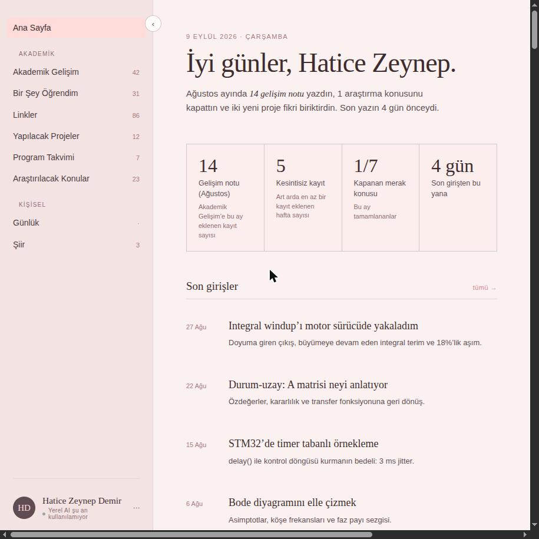
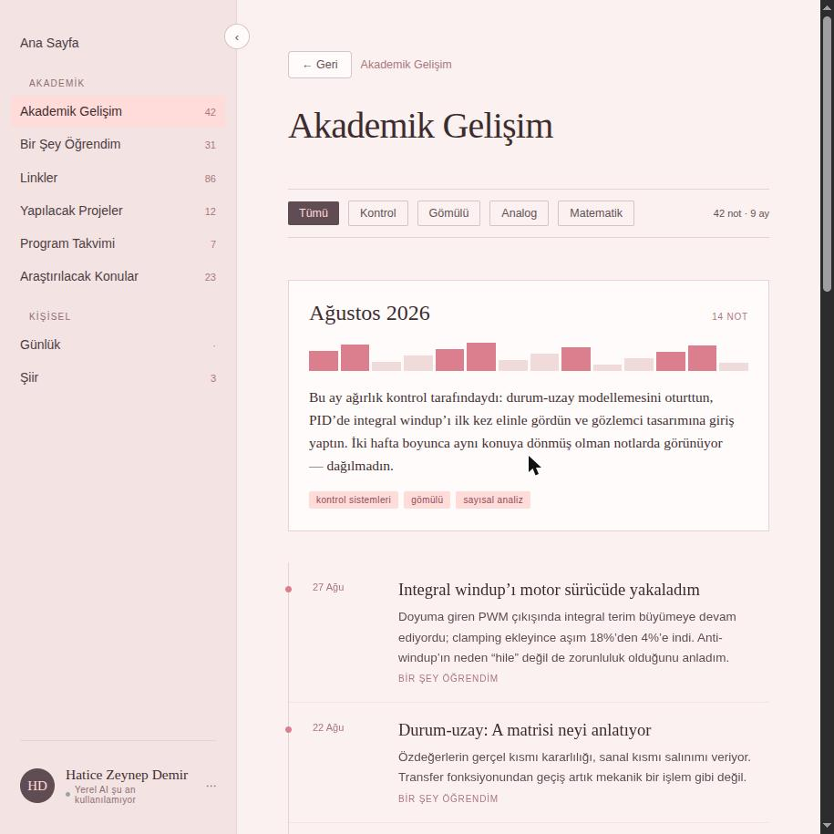
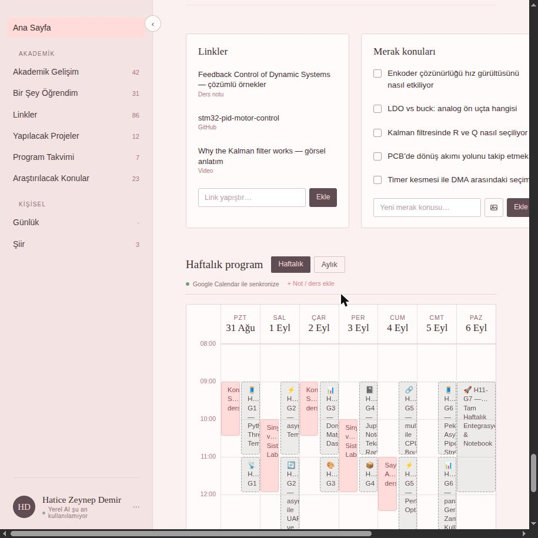
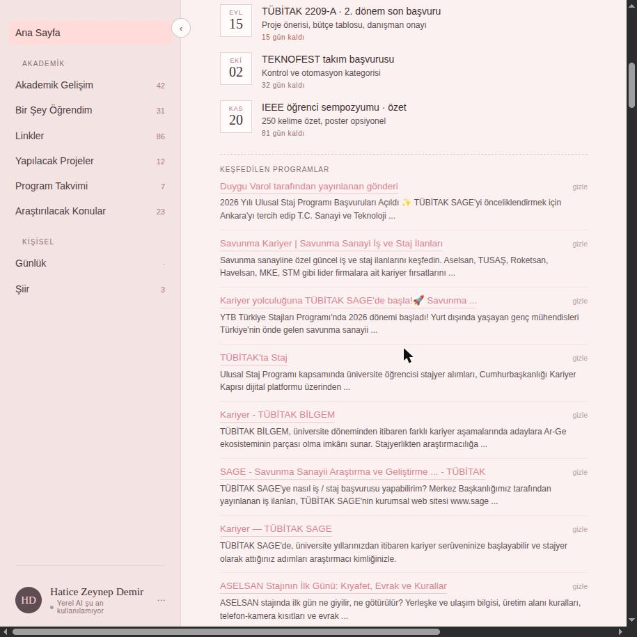

# Mühendis Gelişim Portalı

Kişisel bir akademik gelişim ve bilgi yönetimi platformu — bir mühendislik
öğrencisinin (Mekatronik Mühendisliği, Marmara Üniversitesi) ders notlarını,
öğrendiklerini, günlüğünü, proje fikirlerini, araştırdığı konuları ve
programını/takvimini tek bir yerde tutması, üstüne yerel bir yapay zeka
modeliyle (Ollama) bu içeriği otomatik özetlemesi ve ilgili fırsatları
(TÜBİTAK, Teknofest, hackathon, staj ilanları) otomatik taraması için
yapıldı.

Tek kullanıcılı bir araç — çoklu hesap sistemi yok, tek bir paylaşılan
parola ile korunuyor (bkz. [Güvenlik](#güvenlik)). Canlı: **zdemir.tech**.

Bu proje, Claude Design'da hazırlanan bir prototipten
(`m-hendis-ki-isel-geli-im-platformu/` klasöründeki tasarım dosyası) Vite +
React + TypeScript ile gerçek bir uygulamaya, sonra da (bu README'nin asıl
amacı budur) tam donanımlı, güvenlik katmanlı, yayında bir servise
dönüştürüldü. Geliştirme sürecinin tam kaydı ve ileride eklenmesi
düşünülenler için **[PLAN.md](./PLAN.md)**'ye bakın — bu dosya projenin
"neden"lerini, teknik kısıtlamaları ve aşama aşama alınan kararları
belgeler.

## Ekran görüntüleri

Canlı siteden (zdemir.tech, giriş yapıldıktan sonra), gerçek veriyle.

| Ana Sayfa | Akademik Gelişim |
|---|---|
|  |  |

| Takvim | Program Keşfi |
|---|---|
|  |  |

## Özellikler

### Akademik Gelişim
Aylara göre gruplanmış ders/proje notları — her ay için bir özet kartı
(o ayın etiketleri, not sayısı, kısa bir anlatı) ve altında tarih damgalı
tam not listesi. "Bir Şey Öğrendim" girişlerinden yerel AI ile üretilen
özetler de otomatik olarak buraya, ilgili ayın altına bir not olarak
ekleniyor.

### Bir Şey Öğrendim
Serbest metin günlük türü öğrenme girişleri (başlık + gövde metni).
Kaydedilince arka planda Ollama'ya gönderiliyor, tek cümlelik bir özet
üretiliyor ve bu özet hem girişin kendi sayfasında hem Akademik Gelişim'de
gösteriliyor. Ollama o an erişilemezse giriş "özetlenmedi" durumunda kalır
ve bir dahaki sefere otomatik olarak tekrar denenir (bkz.
[Yerel AI kısıtlaması](#mimari-karar-1-yerel-ai-ollama)).

### Günlük
Kişisel, şifreli bir günlük. Site parolasından bağımsız, ikinci bir günlük
parolasıyla açılıyor; girişler tarayıcıda (Web Crypto API ile) gerçekten
şifreleniyor — ne parola ne de düz metin hiçbir yerde saklanmıyor. Ekrandan
çıkılınca veya geri tuşuna basılınca otomatik kilitleniyor.

### Linkler
Kategorilere (GitHub, ders notu, makale, araç, okunmadı vb.) ayrılmış bir
yer imi/kaynak arşivi. Her linke not ve etiket eklenebilir, tıklanınca
"linke git" veya "detayları gör" seçeneği sunan bir menü açılır.

### Yapılacak Projeler
Proje fikirlerinin durumla (fikir/planlandı/devam ediyor/tamamlandı)
takip edildiği bir pano. Her proje kendi detay sayfasına açılır: not,
fotoğraf (Cloudinary'de saklanır), ve alt görevlerden oluşan bir checklist.

### Program Takvimi
TÜBİTAK başvuruları, Teknofest son tarihleri gibi yaklaşan programların
listesi — her birine not, link ve dosya (ör. şartname PDF'i) eklenebilir,
kalan gün sayısı otomatik hesaplanır ve renkle (yakınsa kırmızı) vurgulanır.

### Şiir
Yazılan şiirlerin listelendiği sade bir arşiv — ekleme/düzenleme/silme
tam destekli.

### Araştırılacak Konular
Bir checklist: not alma tarihi ve tamamlanma tarihiyle takip edilen açık
sorular/merak konuları. Her konuya birden fazla ilgili link eklenebilir;
tamamlananlar isteğe bağlı olarak bir "Bir Şey Öğrendim" girişine
bağlanabilir.

### Program Keşfi
Önceden tanımlanmış anahtar kelimelerle (TÜBİTAK, Teknofest, hackathon,
staj ilanları — bkz. `server.js` → `DISCOVER_KEYWORDS`) haftalık olarak
SerpApi üzerinden otomatik web taraması yapılır, sonuçlar Upstash Redis'te
saklanır ve daha önce görülenler tekrar gösterilmez. Profil filtresi
(kullanıcının mühendislik disiplinine alakasız sonuçları — ör. maden,
inşaat — eleme), aynı zamanda son başvuru tarihi ve kısa bir açıklama
çıkarımı, tarama anında değil, **uygulama Ollama'nın erişilebilir olduğu
bir cihazda açıldığında** yerel modelle yapılır. Süresi geçmiş sonuçlar
otomatik olarak elenir. Sol menüdeki kendi sayfasında kategoriye
(hackathon/TÜBİTAK/Teknofest/staj) göre gruplanmış olarak, Ana Sayfa'da
ise tarihe göre sıralı, dörderli bir carousel olarak gösterilir. Her
sonucun yanında bir "Takip et" aksiyonu var — tıklanınca o sonuç, elle
tarih/not girmeden, Program Takvimi'ne gerçek bir kayıt olarak eklenir.
Yeni + alakalı bulunan sonuçlar tek bir toplu Telegram mesajıyla da
bildirilir.

### Takvim (Ana Sayfa)
Haftalık (saat bazlı, ders/etkinlik blokları) ve aylık (gün başına
gösterge noktaları) iki görünümlü bir takvim. Google Calendar'daki gerçek
etkinlikler salt-okunur olarak senkronize edilir ve yerel notlardan
görsel olarak ayrılır (bkz.
[Google Calendar salt-okunur kararı](#mimari-karar-2-google-calendar-salt-okunur)).
Bir güne tıklanınca not/ders eklenebilen bir detay paneli açılır.

### Profil
Sol menünün altındaki profil kartından ad/soyad ve bir profil fotoğrafı
(Cloudinary'de saklanır, aynı yükleme akışı diğer fotoğraflarla ortak)
düzenlenebilir. Aynı yerden **çıkış yap** — oturum çerezini temizler,
tekrar site parolası sorar.

## Teknik mimari

**Yığın:**
- **Frontend:** React 19 + TypeScript, Vite ile derleniyor. Ekran
  geçişleri URL hash'iyle senkronize (`#growth`, `#learn/0` gibi) — ayrı
  bir router kütüphanesi yok.
- **Backend:** `server.js` — Express 5. Derlenmiş `dist/`'i sunar, site
  geneli oturum korumasını uygular, ve tarayıcının doğrudan
  erişemeyeceği dış servislere (Google Calendar, Cloudinary, SerpApi,
  Telegram, Upstash) vekil (proxy) olarak görev yapar.
- **Kalıcı veri — hangi veri nerede duruyor:**
  | Veri | Nerede | Neden |
  |---|---|---|
  | Akademik Gelişim, Bir Şey Öğrendim, Günlük (şifreli), Linkler, Proje Fikirleri, Araştırılacak Konular, Şiir, profil adı, "Takip et" ile eklenen program kayıtları | Tarayıcının **`localStorage`**'ı | Kişisel veri — merkezi bir sunucuya hiç gitmiyor, tamamen cihazda kalıyor |
  | Program Keşfi'nin taradığı/bulduğu sonuçlar | **Upstash Redis** (sunucu tarafı) | Tarayıcı hiç açık değilken (GitHub Actions taraması) yazılabilmesi/okunabilmesi gerekiyor — `localStorage`'a bu mümkün değil |
  | Fotoğraflar (proje/konu/profil) | **Cloudinary** | `localStorage`'a sığmayacak kadar büyük olabiliyorlar (bkz. Aşama 15/16); `localStorage`'da sadece dönen URL duruyor |

  Bunun pratik sonucu: `localStorage` tarayıcıya özel olduğu için, aynı
  siteye başka bir tarayıcı/cihazdan girildiğinde kişisel içerik (notlar,
  günlük, linkler vb.) KARŞI TARAFTA GÖRÜNMEZ — her cihazın kendi
  `localStorage`'ı bağımsızdır. Program Keşfi sonuçları ve fotoğraflar
  bu kuralın istisnası, çünkü onlar zaten sunucu tarafında (Upstash/
  Cloudinary) tutuluyor, cihaza bağlı değil.
- **Barındırma:** **Render** (Web Service/Node) — bkz.
  [Deployment](#deployment).
- **Yerel AI:** **Ollama** (`llama3.1:8b`) — bkz. aşağıdaki mimari karar.
- **Görsel dekorasyon:** Sol menüde, boş alanda, sabit bir setten
  rastgele seçilip zaman zaman değişen düşük opaklıklı bir fotoğraf
  (`public/backgrounds/`) — sade tasarımı bozmayacak şekilde. Şu an
  Zeynep'in kendi seçtiği sabit bir set; otomatik/AI üretilen görsellere
  geçiş PLAN.md'de ayrı bir gelecek aşaması olarak not edildi.

### Mimari Karar 1: Yerel AI (Ollama)
Özetleme ve profil filtresi için bir bulut API'si (OpenAI, Anthropic vb.)
değil, kullanıcının kendi bilgisayarında çalışan **Ollama** kullanılıyor.
Sebep: bu içerik (kişisel gelişim notları, günlük benzeri metinler) mahrem
— hiçbir yere, hiçbir üçüncü tarafa gönderilmesin istendi. Bunun getirdiği
gerçek bir kısıtlama var: **AI özellikleri SADECE Ollama'nın çalıştığı
bilgisayardan kullanılabilir** — production sunucusunun (Render) Ollama'ya
hiçbir şekilde erişimi yok ve olamaz. Bu yüzden "gecikmeli kuyruk" deseni
kullanılıyor: bir cihazdan (ör. telefon, ya da Ollama kapalıyken masaüstü)
eklenen içerik ham/işlenmemiş durumda kalır ("özetlenmedi" / "filtrelenmedi");
uygulama daha sonra Ollama'nın erişilebilir olduğu bilgisayardan açıldığında,
bekleyen tüm içerik arka planda otomatik olarak işlenir. Kullanıcıya hiçbir
hata gösterilmez — bu davranış tamamen sessiz ve beklenen bir durumdur.

### Mimari Karar 2: Google Calendar salt-okunur
Google Calendar entegrasyonu OAuth ile iki yönlü bir senkronizasyon değil,
**gizli bir iCal linkiyle salt-okunur** bir senkronizasyon. Sebep: OAuth
için Google Cloud Console'da bir proje kaydı ve (bu kullanım kapsamı için)
ödeme bilgisi istenmesi — kişisel/ücretsiz bir proje için orantısız bir
gereksinim. iCal linki ise Google Calendar ayarlarından ücretsiz ve anında
alınabiliyor. Bunun doğal sonucu: uygulamadan Google Calendar'a **geri
yazma yok** — sadece okuma. Uygulama içinde eklenen not/dersler
`localStorage`'da kalır, Google Calendar'a hiç gönderilmez.

### Mimari Karar 3: Tek kullanıcı, merkezi deploy
Bu proje "her kullanıcı kendi bilgisayarında kendi kopyasını çalıştırır"
felsefesiyle DEĞİL, **tek kullanıcı + merkezi (Render'da barındırılan) bir
deploy** olarak tasarlandı — zdemir.tech üzerinden her yerden erişilebilir,
ama tek bir kişi (paylaşılan bir parolayla, bkz. Güvenlik) kullanır. Bunun
mimariye iki yansıması var: (1) kullanıcının kendi verisi hâlâ
`localStorage`'da yaşıyor (sunucunun buna erişimi yok — ör. Telegram
bildirimi bu yüzden sadece statik/genel hatırlatmaları raporlayabiliyor,
kullanıcının kendi eklediği notları göremiyor); (2) site herkese açık
olduğu için (Ollama gibi tek-bilgisayara-bağlı özellikler dışında) gerçek
bir erişim koruması (site geneli parola) şart oldu.

## Kurulum

### Gereksinimler
- **Node.js** (18+ önerilir)
- **Ollama** — yerel AI özetleme/profil filtresi için (opsiyonel; kurulu
  değilse bu özellikler sessizce devre dışı kalır, uygulamanın geri kalanı
  normal çalışır). [ollama.com](https://ollama.com)'dan kurup
  `ollama pull llama3.1:8b` çalıştırın.

### Adımlar

```bash
git clone <repo-url>
cd personal_dashboard
npm install
```

`.env.example`'ı `.env.local` olarak kopyalayın ve doldurun:

```bash
cp .env.example .env.local
```

| Değişken | Nereden alınır | Zorunlu mu |
|---|---|---|
| `SITE_PASSWORD` | Kendiniz belirleyin — güçlü bir parola | **Evet** |
| `SESSION_SECRET` | `node -e "console.log(require('crypto').randomBytes(24).toString('hex'))"` ile üretin | **Evet** |
| `GCAL_ICS_URL` | Google Calendar → Ayarlar → (takvim) → "Takvimi entegre et" → "iCal formatındaki gizli adres" | Hayır — yoksa takvim senkronizasyonu pasif kalır |
| `CLOUDINARY_CLOUD_NAME`, `CLOUDINARY_API_KEY`, `CLOUDINARY_API_SECRET` | [cloudinary.com](https://cloudinary.com) → Dashboard (ücretsiz katman) | Hayır — yoksa fotoğraf yükleme çalışmaz |
| `TELEGRAM_BOT_TOKEN` | Telegram'da @BotFather ile `/newbot` | Hayır — yoksa Telegram bildirimleri kapalı |
| `TELEGRAM_CHAT_ID` | @userinfobot veya `https://api.telegram.org/bot<TOKEN>/getUpdates` | Hayır |
| `CRON_SECRET` | `node -e "console.log(require('crypto').randomBytes(24).toString('hex'))"` ile üretin | Hayır — yoksa GitHub Actions tetikleyicileri (günlük bildirim, haftalık tarama) çalışmaz |
| `SERPAPI_KEY` | [serpapi.com](https://serpapi.com) (ücretsiz katman, ayda 250 sorgu) | Hayır — yoksa Program Keşfi taraması çalışmaz |
| `UPSTASH_REDIS_REST_URL`, `UPSTASH_REDIS_REST_TOKEN` | [upstash.com](https://upstash.com) → Redis veritabanı oluştur → Dashboard → "REST API" (ücretsiz katman) | Hayır — yoksa Program Keşfi'nin sonuçları kalıcı olmaz |

`SITE_PASSWORD`/`SESSION_SECRET` **zorunlu** — production'da eksik
bırakılırsa site tamamen korumasız kalır (bkz. [Güvenlik](#güvenlik)).
Diğerleri opsiyonel: eksik olan her entegrasyon kendi özelliğini sessizce
devre dışı bırakır, uygulamanın geri kalanını etkilemez.

```bash
npm run dev      # geliştirme sunucusu (http://localhost:5173)
npm run build    # production derlemesi (dist/)
npm start        # production sunucusu (node server.js — build sonrası)
```

`npm run dev` sırasında Ollama, Google Calendar ve Cloudinary Vite'ın
kendi dev-proxy'leri üzerinden çalışır (bkz. `vite.config.ts`); site
geneli parola koruması ve Telegram/SerpApi/Program Keşfi uç noktaları
sadece `npm start` (`server.js`) ile çalışır.

## Deployment

Uygulama **Render**'da (Web Service, Node ortamı) barındırılıyor —
salt statik barındırma (ör. GitHub Pages) yeterli değil, çünkü `server.js`
hem site geneli oturum korumasını uyguluyor hem Google Calendar/Cloudinary/
Telegram/SerpApi için sunucu tarafı vekil (proxy) görevi görüyor.

- **Build command:** `npm install && npm run build`
- **Start command:** `npm start`
- Yukarıdaki tüm ortam değişkenleri Render'ın "Environment" panelinden
  eklenir (kod içinde asla sabit yazılmaz).
- Özel alan adı (custom domain, `zdemir.tech`) Render'ın "Custom Domains"
  ayarından eklenip, alan adı sağlayıcısında (ör. bir DNS panelinde)
  belirtilen CNAME/A kaydı girilerek bağlandı — DNS doğrulaması birkaç
  saat sürebiliyor.
- Üç **GitHub Actions** workflow'u (`.github/workflows/`) production
  sunucusundaki zamanlanmış görevleri tetikliyor: günlük Telegram
  bildirimi, haftalık Program Keşfi taraması ve Render'ı uykuya
  düşürmeyen 10 dakikalık keep-alive ping'i. İlk ikisinin çalışması için
  GitHub repo secrets'a `CRON_SECRET` ve `APP_URL` eklenmesi gerekiyor;
  keep-alive sadece `APP_URL`'i kullanır.

## Sınırlamalar / Bilinen Kısıtlar

- **Ollama sadece yerelde çalışır** — production sunucusunun (Render)
  hiçbir şekilde erişemeyeceği bir servis. AI özellikleri (özetleme,
  Program Keşfi profil filtresi) sadece Ollama'nın kurulu olduğu
  bilgisayardan uygulama açıldığında işler; bekleyen içerik bir sonraki
  o cihazdan açılışa kadar "işlenmemiş" kalır.
- **Render'ın ücretsiz planı boşta kalınca uyur** — bir süre trafik
  almayan servis "uykuya" geçer ve uyanırken kendi markalı bir ekran
  gösterir. Bunu tamamen ortadan kaldırmak için bir GitHub Actions
  workflow'u (`keep-alive.yml`) her 10 dakikada bir siteye hafif bir
  istek atıp servisi hiç uyutmuyor. Bu workflow bir sebeple çalışmazsa
  (ör. GitHub Actions kesintisi) site yine de uyuyabilir — GitHub
  Actions workflow'ları bu yüzden ayrıca yüksek timeout + retry ile
  yazıldı.
- **Google Calendar entegrasyonu tek yönlü (salt-okunur)** — uygulamadan
  Google Calendar'a not/ders eklenemez, sadece Google Calendar'daki
  etkinlikler uygulamada görüntülenir.
- **Kullanıcının kişisel verisi merkezi bir veritabanında değil,
  `localStorage`'da** — bkz. yukarıdaki "hangi veri nerede duruyor"
  tablosu. Pratik sonucu: farklı bir tarayıcı/cihazdan girildiğinde
  kişisel notlar/girişler karşı tarafta görünmez.
- **Telegram bildirimleri sınırlı bilgiyle çalışır** — sunucunun
  kullanıcının `localStorage`'ındaki kişisel verisine erişimi olmadığı
  için, günlük bildirim sadece statik/genel program listesini raporlar.
- **Program Keşfi ayda 250 sorguluk ücretsiz SerpApi kotasıyla sınırlı** —
  haftalık taramalar bunun çok altında kalıyor ama aşırı sık manuel
  tetiklemeler kotayı tüketebilir.
- **Site geneli oturum stateless** — 30 gün sonra kendiliğinden düşer
  (veya profil menüsünden manuel "çıkış yap" ile hemen).

## Güvenlik

- **Site geneli giriş:** Tek paylaşılan parola (`SITE_PASSWORD`) + imzalı,
  stateless bir oturum çerezi (30 gün). Oturum sunucuda saklanmıyor —
  Render sık sık yeniden başladığı için bellekte tutulan bir oturum
  listesi işe yaramaz. `SESSION_SECRET`'ı değiştirmek tüm oturumları aynı
  anda geçersiz kılar (şüpheli bir erişimden sonra "herkesi çıkışa
  zorlamak" için kullanılabilir).
- IP başına 5 başarısız giriş denemesinden sonra 60 saniyelik kilit
  (bellek içi, Render yeniden başlayınca sıfırlanır — tam bir çözüm değil
  ama otomatik parola denemesini pratik olmaktan çıkarır).
- `X-Frame-Options`, `X-Content-Type-Options`, `Referrer-Policy` başlıkları
  her yanıtta gönderiliyor.
- Günlük (Diary) girişleri gerçekten şifreleniyor: AES-GCM, tarayıcıda
  (Web Crypto API), günlük parolasından PBKDF2 (250.000 iterasyon) ile
  türetilen bir anahtarla. Günlük parolası (site parolasından ayrı, ikinci
  bir katman) hiçbir yerde saklanmıyor — sadece kilit açıkken bellekte.
  Şifreli veri hem `localStorage`'da hem (varsa) senkronize edildiği her
  yerde düz metin değil, base64 bir blob olarak duruyor.
- Ortam değişkenlerinin hiçbiri istemciye (tarayıcıya gönderilen koda)
  sızmıyor — hepsi sadece `server.js`/`vite.config.ts` (Node tarafı) içinde
  okunuyor, build çıktısında aranıp doğrulandı.
- Parola/sır karşılaştırmaları (`SITE_PASSWORD`, `CRON_SECRET`, oturum
  imzası) sabit zamanlı (timing-safe) — `===` yerine
  `crypto.timingSafeEqual` kullanılıyor.

## Yol haritası

Geliştirme sürecinin tam kaydı, alınan her teknik kararın gerekçesi ve
ileride eklenmesi düşünülen özellikler (ör. anahtar kelimelerin kullanıcı
içeriğinden otomatik çıkarılması) için **[PLAN.md](./PLAN.md)**'ye bakın.
